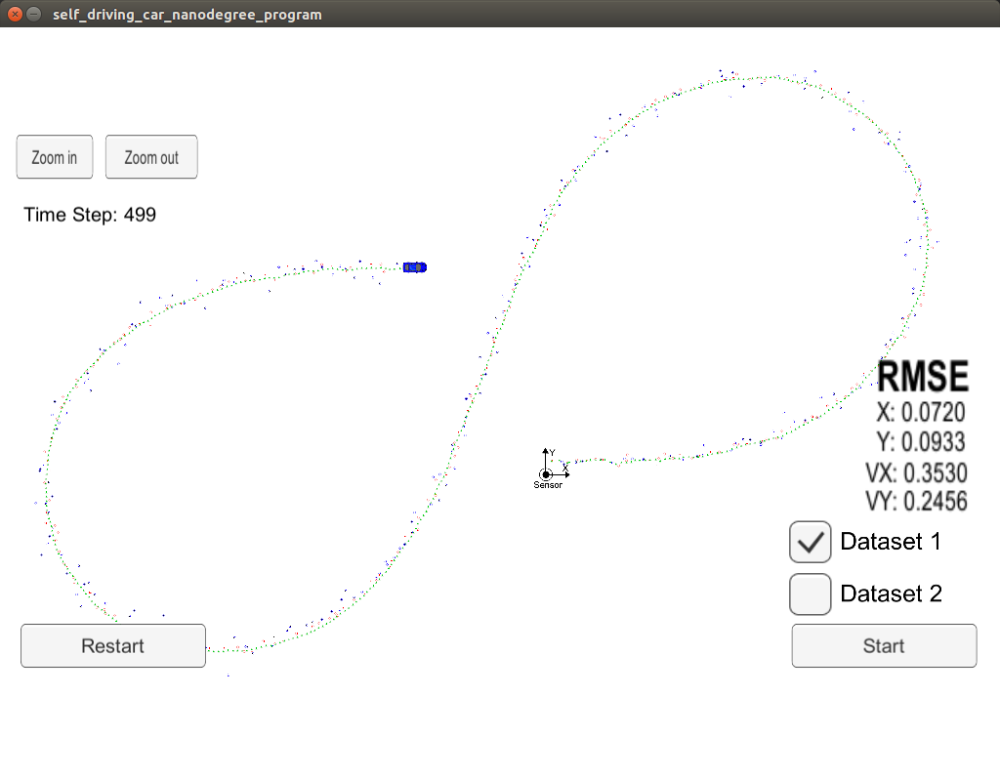
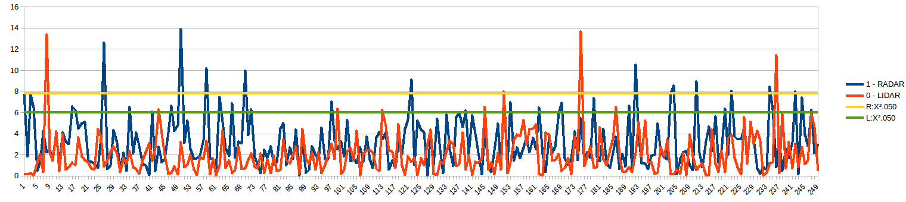

# UKF_Cman
# Submission for Term2 Project 2: Unscented Kalman Filters

>Environment setup, algorithm docu and boilerplate code provided by Udacity 
under https://github.com/udacity/CarND-Unscented-Kalman-Filter-Project. 
Improvements where made to:

- src/ukf.cpp
- src/ukf.h
- src/tools.cpp

In ukf.cpp, __initialized__ the UKF and implemented the process model in __ProcessMeasurement()__ function. Prepared matrices and vectors in function __Prediction()__ for __augmented sigma points__, __sigma point prediction__ and __prediction of mean and covariance__. Updated the filter calling related update functions __UpdateLidar()__ and __UpdateRadar()__, each calling __UpdateUKF()__ also calculating and writing NIS to file __"NIS_data_file.cvs"__.
In ukf.h completed parameter and function declarations.
In tools.cpp, filled the functions that calculate root mean squared error __"RMSE"__.

Objective is implementing an unscented Kalman filter in C++ to estimate the state of a moving object of interest with noisy lidar and radar measurements. This requires implementing non-linear CTRV model equations in __"Basics Unscented Transformation"__.
Passing the project requires obtaining RMSE values that are lower than the tolerance outlined in the project rubric, 
pls see https://review.udacity.com/#!/rubrics/783/view

This project involves the Term 2 Simulator which can be downloaded here: https://github.com/udacity/self-driving-car-sim/releases. A server package uWebSocketIO is setting up a connection from the C++ program to the simulator, which acts as the host.

## Running the project
> Basic Build Instructions
1. Clone this repo.
2. Make a build directory: mkdir build && cd build
3. Compile: cmake .. && make
4. Run it: ./UnscentedKF
5. Run and start the simulator

## Results
Lidar measurements are red circles, radar measurements are blue circles with an arrow pointing in the direction of the observed angle, and estimation markers are green triangles.

> The results Dataset 1 are:

The NIS consistency check indicates healthy filter parameters

